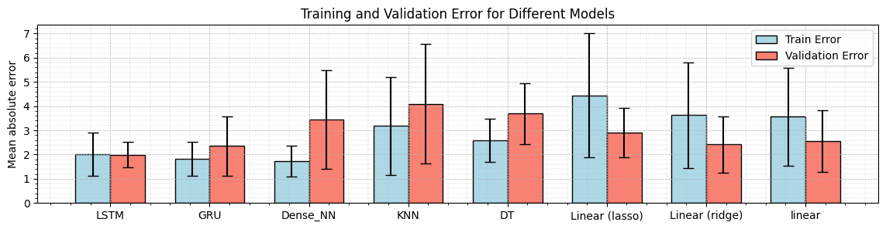

# 📈 eua_prediction_clean

> **EUA (EU 탄소배출권) 가격 예측을 위한 머신러닝 모델링 실습 프로젝트**  
> 탄소 포집·운송·저장 전주기 경제성 평가 교육 - 실습  
> 인하대학교 에너지자원공학과  
> Subsurface Analysis Laboratory

---

## 👥 참여자

- 조홍근 (인하대학교 조교수)  
- 박은실 (인하대학교)  
- 강승우 (인하대학교)

---

## 🎯 프로젝트 목적

본 프로젝트는 **유럽 탄소배출권(EUA, EU Emissions Allowance)**의 가격을 주요 경제지표 및 에너지 가격 데이터를 바탕으로 예측하는 것을 목표로 합니다.  
탄소 포집·이송·저장(CCS) 전주기 경제성 평가 교육의 실습 과제로 수행되었으며, 기계학습 기법을 활용하여 시계열 데이터 기반의 예측 모델을 개발하고자 하였습니다.

---

## 🧪 방법론

### 🔧 Feature Engineering (특성 엔지니어링)
- **상관관계 분석**: 주요 경제지표 및 에너지 가격과 EUA 가격 간의 관계 분석  
- **자기상관 및 교차상관 분석**: 시간 지연에 따른 변수 간 영향 파악  
- **PCA (주성분 분석)**: 차원 축소 및 주요 정보 추출  
- **군집 분석 기반 유사 트렌드 구간 분류**: 시계열 내 패턴 유사 구간 탐지

### 🤖 머신러닝 모델 개발
- **LSTM (Long Short-Term Memory)** 모델 기반 시계열 예측 수행  
  - 과거 시계열 데이터를 입력으로 향후 EUA 가격을 예측  
  - 트렌드와 이벤트 반응을 장기적으로 반영
- **기타 모델과의 성능 비교**:  
  - 랜덤 포레스트, XGBoost, 서포트 벡터 회귀(SVR) 등의 모델과 LSTM 성능 비교
  - 결과비교:
  
---

## 📁 프로젝트 폴더 구조

```bash
eua_prediction_clean/
│
├── data/                # 입력 데이터 (경제지표, 에너지 가격 등)
├── notebooks/           # 분석 및 모델링용 Jupyter 노트북
├── models/              # 학습된 모델 및 결과 저장
├── src/                 # 데이터 처리, 모델링 코드
├── results/             # 시각화 및 분석 결과
└── README.md            # 프로젝트 설명 파일 (본 문서)
```

## 📜 라이선스
- 본 프로젝트는 학술적/교육적 목적으로 개발되었으며, 상업적 이용은 제한됩니다.
- 협업 또는 인용 관련 문의는 담당자에게 연락주시기 바랍니다: honggeun.jo@inha.ac.kr

## 🙏 감사의 말씀
본 프로젝트는 인하대학교 에너지자원공학과 Subsurface Analysis Lab의 지원 아래
**“탄소 포집·운송·저장 전주기 경제성 평가 교육 프로그램”**의 실습 과정으로 수행되었습니다
